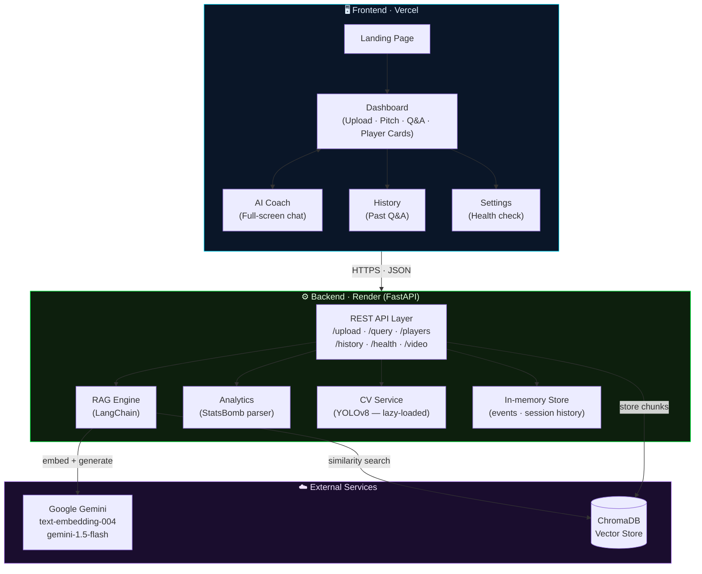
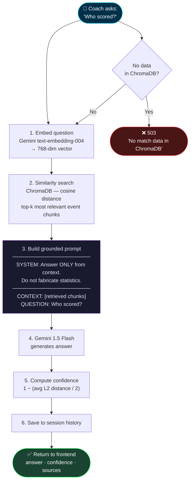
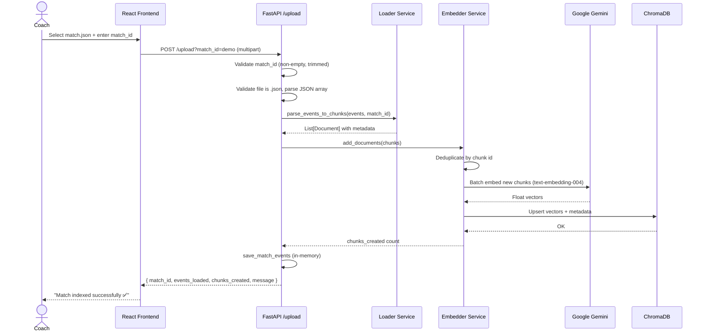
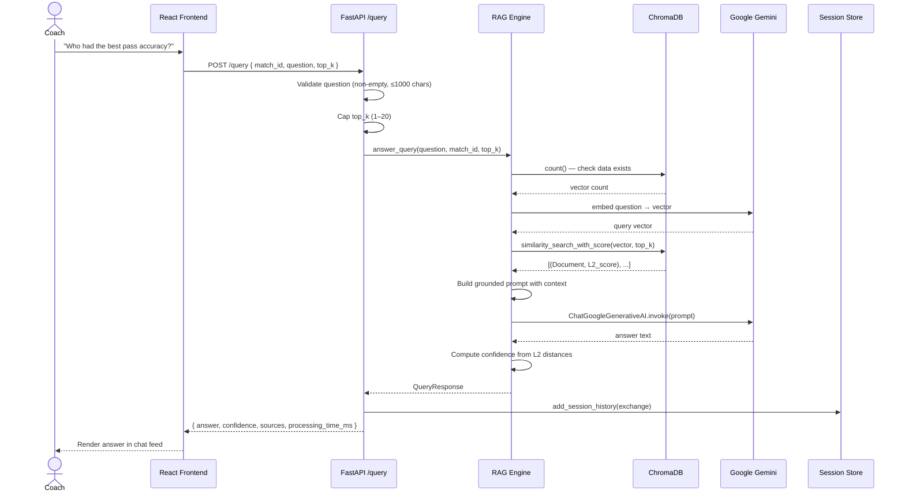
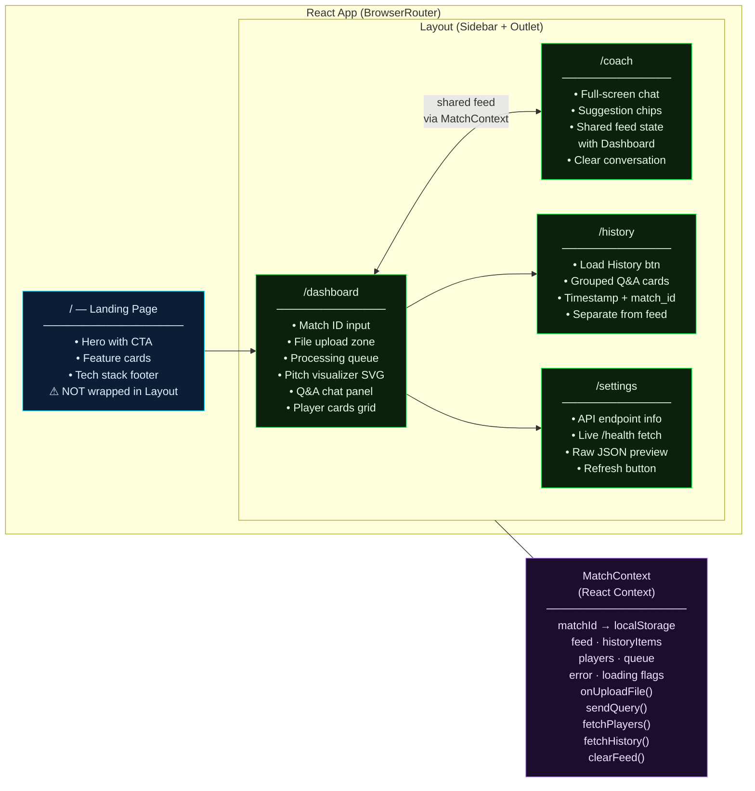
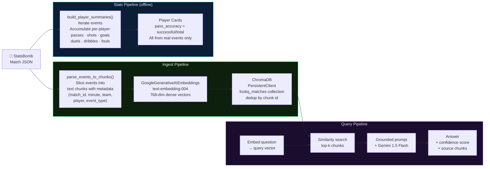
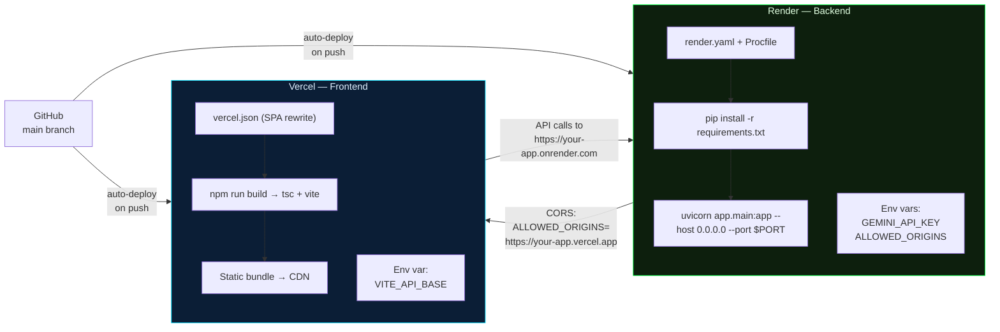

<div align="center">

<br/>

```
███████╗ ██████╗  ██████╗ ████████╗██╗ ██████╗
██╔════╝██╔═══██╗██╔═══██╗╚══██╔══╝██║██╔═══██╗
█████╗  ██║   ██║██║   ██║   ██║   ██║██║   ██║
██╔══╝  ██║   ██║██║   ██║   ██║   ██║██║▄▄ ██║
██║     ╚██████╔╝╚██████╔╝   ██║   ██║╚██████╔╝
╚═╝      ╚═════╝  ╚═════╝    ╚═╝   ╚═╝ ╚══▀▀═╝
```

### Tactical Intelligence from Real Match Data

*Upload StatsBomb JSON → ask your AI coach anything → get grounded, real answers*

<br/>

[](https://fastapi.tiangolo.com/)
[](https://react.dev/)
[](https://ai.google.dev/)
[](https://www.trychroma.com/)
[](https://render.com/)
[](https://vercel.com/)

<br/>

</div>

---

## What is FootIQ?

FootIQ is a **full-stack football analytics platform** built on a Retrieval-Augmented Generation (RAG) pipeline. It turns raw StatsBomb match-event data into a conversational analytics experience — coaches can upload a match file and immediately ask natural-language questions like *"who had the best pass accuracy?"* or *"which player created the most chances?"* and get answers sourced **only** from the real match data.

> 🔒 **Honesty by design.** The AI is system-prompted to say *"I don't have enough match data to answer this"* rather than fabricate statistics. Every answer is traceable to a retrieved event chunk.

---

## Table of Contents

- [Core Features](#-core-features)
- [System Architecture](#-system-architecture)
- [RAG Pipeline — How a Question Gets Answered](#-rag-pipeline--how-a-question-gets-answered)
- [Upload Workflow](#-upload-workflow)
- [Query Workflow](#-query-workflow)
- [Frontend Page Map](#-frontend-page-map)
- [Data Flow — End to End](#-data-flow--end-to-end)
- [Tech Stack](#-tech-stack)
- [Project Structure](#-project-structure)
- [Local Setup](#-local-setup)
- [Testing the Code](#-testing-the-code)
- [API Reference](#-api-reference)
- [Deployment](#-deployment)
- [Environment Variables](#-environment-variables)
- [Known Limitations](#-known-limitations)

---

## ✨ Core Features

| Feature | Description |
|---------|-------------|
| 📥 **Match Ingestion** | Upload any [StatsBomb-format](https://github.com/statsbomb/open-data) JSON. FootIQ parses events, chunks them with metadata, embeds via Gemini, and indexes into ChromaDB. |
| 🤖 **AI Coach** | Ask anything in plain English. Answers are generated by Gemini 1.5 Flash, grounded strictly to the retrieved match context. No hallucinated stats. |
| 📊 **Player Cards** | Pass accuracy, shots, goals, dribbles completed, duels won/lost, fouls — all derived in real time from the event stream. |
| 🕘 **Session History** | Every Q&A exchange is stored chronologically and replayable across sessions. |
| 🩺 **Health Dashboard** | Live backend health check: ChromaDB connectivity, vector count, indexed collections. |
| 🎥 **Video Tracking** *(optional)* | Upload match footage → YOLOv8 tracks players frame-by-frame → movement heatmaps + sprint counts returned. Requires ≥ 2 GB RAM. |

---

## 🏗 System Architecture



---

## 🔁 RAG Pipeline — How a Question Gets Answered



---

## 📤 Upload Workflow



---

## 🔍 Query Workflow



---

## 🗺 Frontend Page Map



---

## 🌊 Data Flow — End to End



---

## 🧰 Tech Stack

### Backend

| Package | Version | Role |
|---------|---------|------|
| `fastapi` | 0.115 | API framework |
| `uvicorn` | 0.34 | ASGI server |
| `langchain` + `langchain-community` | 0.3 | RAG orchestration |
| `langchain-google-genai` | 2.0 | Gemini embeddings + chat |
| `chromadb` | 0.6 | Local vector store |
| `pydantic` | 2.10 | Request/response schemas |
| `python-multipart` | 0.0.18 | File upload handling |
| `ultralytics` | 8.3 | YOLOv8 tracking *(lazy-loaded)* |
| `opencv-python-headless` | 4.10 | Frame processing *(lazy-loaded)* |

### Frontend

| Package | Version | Role |
|---------|---------|------|
| `react` + `react-dom` | 19 | UI framework |
| `react-router-dom` | 7 | Client-side routing |
| `vite` | 8 | Build tool |
| `tailwindcss` | 4 | Utility CSS |
| `lucide-react` | 1.17 | Icon set |
| `typescript` | 5 | Type safety |

---

## 📂 Project Structure

```
FootIQ/
│
├── README.md
├── DEPLOYMENT.md                         # Step-by-step Render + Vercel guide
│
├── footiq-backend/                       # FastAPI service
│   ├── Procfile                          # Render start command
│   ├── render.yaml                       # Render IaC config
│   ├── requirements.txt                  # Pinned deps (minor-version ranges)
│   ├── .env.example                      # Secret template (never commit .env)
│   │
│   ├── app/
│   │   ├── main.py                       # App factory, CORS, lifespan, routers
│   │   ├── config.py                     # Env-var config (GEMINI_API_KEY etc.)
│   │   │
│   │   ├── routes/
│   │   │   ├── health.py                 # GET /health
│   │   │   ├── upload.py                 # POST /upload  ← main ingest entry point
│   │   │   ├── query.py                  # POST /query   ← main AI entry point
│   │   │   ├── players.py                # GET /players/{match_id}
│   │   │   ├── history.py                # GET /history
│   │   │   ├── ingest.py                 # POST /ingest  (server-side DATA_DIR)
│   │   │   └── video.py                  # POST /video/upload + status/heatmap
│   │   │
│   │   ├── services/
│   │   │   ├── embedder.py               # ChromaDB client + Gemini embeddings
│   │   │   ├── rag.py                    # Retrieve → ground → generate
│   │   │   ├── analytics.py              # StatsBomb event → player stat aggregation
│   │   │   ├── loader.py                 # JSON → LangChain Document chunks
│   │   │   ├── store.py                  # In-memory event + session history store
│   │   │   └── cv_service.py             # YOLOv8 tracking (cv2 + ultralytics lazy)
│   │   │
│   │   └── models/
│   │       └── schemas.py                # Pydantic request/response models
│   │
│   └── tests/
│       └── sample_match_debug.json       # Minimal 3-event StatsBomb sample
│
└── footiq-frontend/                      # React + Vite SPA
    ├── vercel.json                        # SPA rewrite rule (no 404 on refresh)
    ├── .env.example                       # VITE_API_BASE template
    ├── index.html
    │
    └── src/
        ├── App.tsx                        # Router shell (BrowserRouter + Routes)
        ├── types.ts                       # Shared TS types (QueueItem, FeedMessage, PlayerCard)
        │
        ├── context/
        │   └── MatchContext.tsx           # Global state + API functions (useMatch hook)
        │
        ├── components/
        │   ├── Layout.tsx                 # Sidebar shell + <Outlet />
        │   ├── PlayerCard.tsx             # Player stat card component
        │   └── Radar.tsx                  # SVG pentagon radar chart
        │
        └── pages/
            ├── LandingPage.tsx            # / — marketing entry (no Layout)
            ├── Dashboard.tsx              # /dashboard — upload + pitch + Q&A + players
            ├── Coach.tsx                  # /coach — full-screen AI chat
            ├── HistoryPage.tsx            # /history — past Q&A sessions
            └── Settings.tsx              # /settings — health check + config
```

---

## 🚀 Local Setup

### Prerequisites

- **Python 3.11+**
- **Node.js 18+**
- **Google Gemini API key** → free at [aistudio.google.com](https://aistudio.google.com/)

### Backend

```bash
cd footiq-backend

# 1. Isolated environment
python -m venv .venv
source .venv/bin/activate       # Windows: .venv\Scripts\activate

# 2. Install dependencies (ultralytics/torch excluded = faster, ~150 MB)
pip install -r requirements.txt

# 3. Configure secrets — edit .env and set your real key
cp .env.example .env
# GEMINI_API_KEY=AIza...
# ALLOWED_ORIGINS=http://localhost:5173

# 4. Start
uvicorn app.main:app --reload --port 8000
```

Interactive API docs: **http://localhost:8000/docs**

### Frontend

```bash
cd footiq-frontend

npm install

# Point at your local backend
cp .env.example .env
# VITE_API_BASE=http://localhost:8000

npm run dev
```

Open **http://localhost:5173** → click **Launch App** → you're in.

### Quick first match

1. Go to **Dashboard**, set `match_id` to `demo`
2. Click **Upload** → pick `footiq-backend/tests/sample_match_debug.json`
3. Ask *"Who scored?"* in the Q&A panel
4. Open **Settings** → confirm `chroma_connected: true`

---

## 🧪 Testing the Code

### Backend — offline (no Gemini key needed)

```bash
cd footiq-backend
source .venv/bin/activate

# Server health
curl http://localhost:8000/health
# → {"status":"ok","chroma_connected":true,"vector_count":0,"collections":[]}

# Validation: empty match_id must be rejected
curl -X POST "http://localhost:8000/upload?match_id=" \
     -F "file=@tests/sample_match_debug.json"
# → 422 {"detail":"match_id cannot be empty"}

# Validation: non-JSON file rejected
echo "not json" > /tmp/x.txt
curl -X POST "http://localhost:8000/upload?match_id=m1" \
     -F "file=@/tmp/x.txt"
# → 400 {"detail":"Only JSON files are supported"}

# Player-stat aggregation (pure Python, zero AI)
python -c "
import json
from app.routes.players import build_player_summaries
events = json.load(open('tests/sample_match_debug.json'))
print(json.dumps(build_player_summaries(events), indent=2))
"
# → Bob Debug: 1 shot / 1 goal
# → Alice Debug: 1 pass @ 100% / 1 duel won
```

### Run unit tests

```bash
cd footiq-backend
pytest
```

### Frontend — type-check and build

```bash
cd footiq-frontend
npm run build
# tsc + vite → dist/  (~268 KB JS, ~30 KB CSS)
```

### What requires a live Gemini key

| Test | Offline | Needs key |
|------|---------|-----------|
| App boots, all routes registered | ✅ | |
| Health check, validation, CORS | ✅ | |
| Player stat aggregation | ✅ | |
| Frontend production build | ✅ | |
| Embedding & uploading a real match | | ✅ |
| AI Q&A responses | | ✅ |
| Video tracking (YOLOv8) | | needs ≥ 2 GB RAM |

---

## 📚 API Reference

Base URL (local): `http://localhost:8000` · Docs: `/docs`

| Method | Endpoint | Body / Params | Response |
|--------|----------|---------------|----------|
| `GET` | `/health` | — | `{ status, chroma_connected, vector_count, collections }` |
| `POST` | `/upload` | `?match_id=` + JSON file (multipart) | `{ match_id, events_loaded, chunks_created, message }` |
| `POST` | `/query` | `{ match_id, question, top_k? }` | `{ answer, confidence, sources, processing_time_ms }` |
| `GET` | `/players/{match_id}` | `?limit=` | Array of player stat cards |
| `GET` | `/players/{match_id}/{player_name}` | — | Narrative text summary |
| `GET` | `/history` | `?limit=` | `{ total, items[] }` |
| `POST` | `/ingest` | — | Re-index files from `DATA_DIR` |
| `POST` | `/video/upload` | video file (multipart) | `{ task_id }` |
| `GET` | `/video/status/{task_id}` | — | `{ status, progress, sprints, processed_frames }` |
| `GET` | `/video/heatmap/{task_id}` | — | `{ heatmap: [{x, y}] }` |

**Example — upload:**

```bash
curl -X POST "http://localhost:8000/upload?match_id=demo" \
     -F "file=@match_events.json"
```

**Example — query:**

```bash
curl -X POST http://localhost:8000/query \
     -H "Content-Type: application/json" \
     -d '{"match_id":"demo","question":"Who had the best pass accuracy?","top_k":5}'
```

---

## 🌐 Deployment



Full step-by-step guide with secret setup, CORS wiring, and smoke-test checklist → **[DEPLOYMENT.md](./DEPLOYMENT.md)**

**Quick reference:**

| | Backend | Frontend |
|---|---|---|
| Platform | Render | Vercel |
| Root dir | `footiq-backend` | `footiq-frontend` |
| Build cmd | `pip install -r requirements.txt` | `npm run build` |
| Start cmd | `uvicorn app.main:app --host 0.0.0.0 --port $PORT` | *(static, no server)* |
| Required secrets | `GEMINI_API_KEY`, `ALLOWED_ORIGINS` | `VITE_API_BASE` |

---

## 🔐 Environment Variables

**Backend** (`footiq-backend/.env` locally · Render dashboard in production):

| Variable | Required | Default | Description |
|----------|----------|---------|-------------|
| `GEMINI_API_KEY` | ✅ | — | Google Gemini key. **Never commit this.** |
| `ALLOWED_ORIGINS` | ✅ prod | `http://localhost:5173` | Comma-separated CORS origins. |
| `CHROMA_PATH` | — | `./chroma_db` | ChromaDB persistence directory. |
| `DATA_DIR` | — | `./data` | Auto-ingest JSON folder on startup. |

**Frontend** (`footiq-frontend/.env` locally · Vercel dashboard in production):

| Variable | Required | Description |
|----------|----------|-------------|
| `VITE_API_BASE` | ✅ | Backend URL. Inlined at build time — **redeploy after changing.** |

> All `.env` files are gitignored. Secrets never enter source control.

---

## ⚠️ Known Limitations

| Limitation | Detail |
|-----------|--------|
| **Render free tier sleeps** | First request after ~15 min idle takes 30–50 s to wake. |
| **No persistent disk (free tier)** | ChromaDB resets on every Render deploy. Re-upload match JSON after a restart. Paid disk or Qdrant Cloud free tier fix this. |
| **Video CV needs ≥ 2 GB RAM** | YOLOv8 + PyTorch won't run on the 512 MB free tier. App boots fine regardless (imports are lazy). Use a paid instance for video. |
| **Session history is in-memory** | History resets when the backend restarts. |
| **Single-user, no auth** | No workspaces or user isolation. Suitable for personal or demo use. |

---

<div align="center">
<br/>

**Built with FastAPI · React 19 · LangChain · Google Gemini · ChromaDB · YOLOv8**

<br/>

*StatsBomb is a trademark of StatsBomb Ltd. This project is not affiliated with or endorsed by StatsBomb.*

</div>
