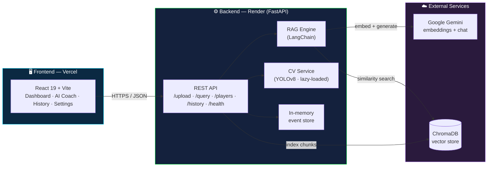
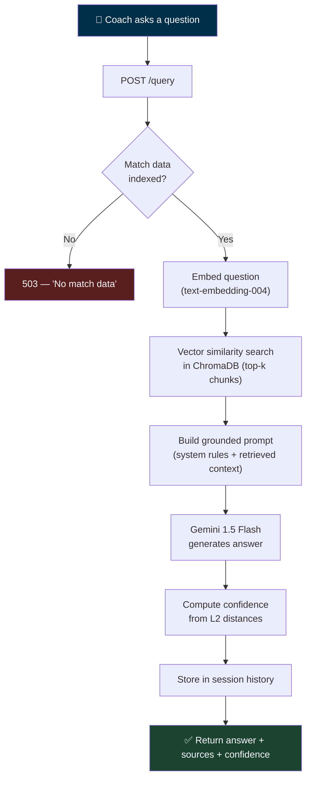
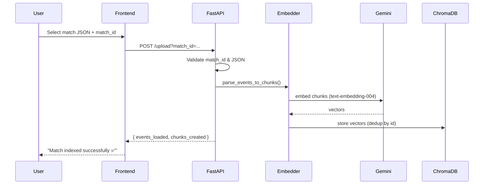
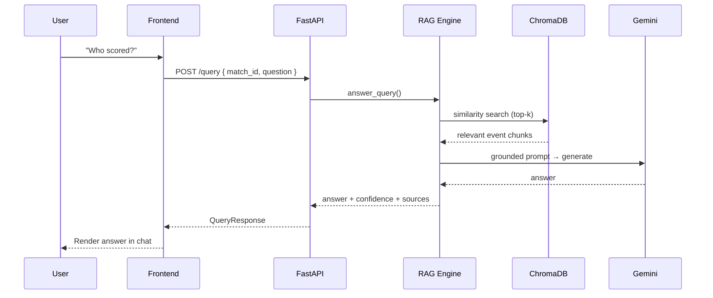
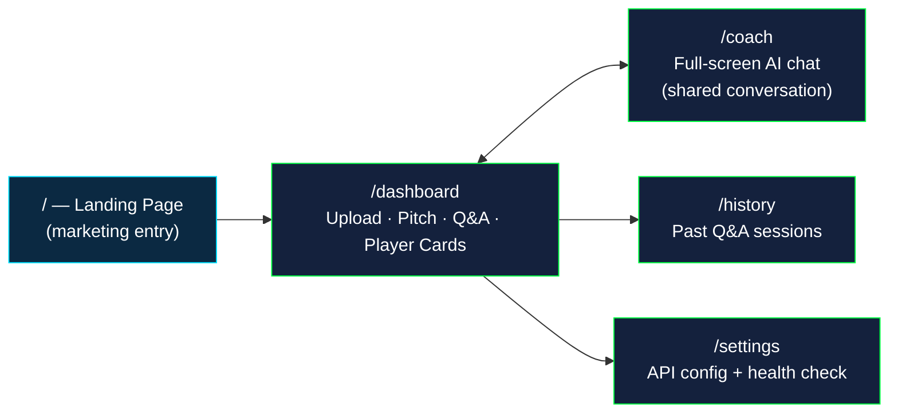
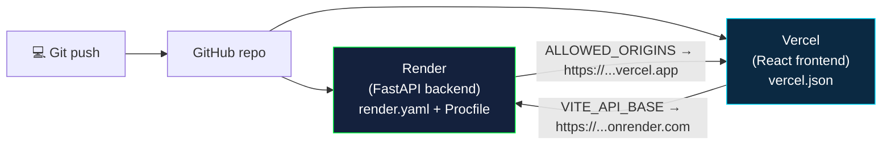

<div align="center">

# ⚽ FootIQ

### Tactical Intelligence from Real Match Data

**Upload StatsBomb match data → ask an AI coach anything → get grounded, factual answers.**

FootIQ is a full-stack football analytics platform that turns raw match-event JSON into a
conversational analytics experience. It pairs a **Retrieval-Augmented Generation (RAG)** pipeline
(Google Gemini + ChromaDB) with a multi-page React dashboard, plus an optional computer-vision
module (YOLOv8) for video tracking.

[](https://fastapi.tiangolo.com/)
[](https://react.dev/)
[](https://ai.google.dev/)
[](https://www.trychroma.com/)
[](./DEPLOYMENT.md)

</div>

---

## 📑 Table of Contents

- [What It Does](#-what-it-does)
- [Architecture](#-architecture)
- [How a Question Gets Answered (RAG Flow)](#-how-a-question-gets-answered-rag-flow)
- [Upload & Query Sequences](#-upload--query-sequences)
- [Frontend Page Map](#-frontend-page-map)
- [Tech Stack](#-tech-stack)
- [Project Structure](#-project-structure)
- [Getting Started (Local)](#-getting-started-local)
- [Testing the Code](#-testing-the-code)
- [API Reference](#-api-reference)
- [Deployment](#-deployment)
- [Environment Variables](#-environment-variables)
- [Limitations & Roadmap](#-limitations--roadmap)

---

## 🎯 What It Does

| Capability | Description |
|-----------|-------------|
| 📥 **Ingest** | Upload [StatsBomb-format](https://github.com/statsbomb/open-data) match-event JSON. FootIQ parses, chunks, and embeds it into a vector store. |
| 💬 **Ask** | Ask natural-language questions ("Who created the most chances?"). Gemini answers **only** from your indexed match data — no hallucinated stats. |
| 📊 **Squad Stats** | Auto-derived player cards: passes, pass accuracy, shots, goals, dribbles, duels, fouls — computed directly from event data. |
| 🕘 **History** | Every Q&A exchange is stored and replayable in a chronological feed. |
| 🎥 **Video (optional)** | Upload match footage → YOLOv8 tracks players → returns movement heatmaps and sprint counts. *(Requires ≥2 GB RAM.)* |

> 🔒 **Honesty by design:** the AI is system-prompted to answer *only* from retrieved context and to
> say "I don't have enough match data to answer this" rather than fabricate. No fake metrics are
> ever shown in the UI.

---

## 🏗 Architecture



---

## 🔁 How a Question Gets Answered (RAG Flow)



The system prompt enforces grounding:

```text
Answer ONLY using the match data provided in the context below.
If the answer is not in the context, say:
  'I don't have enough match data to answer this.'
Never guess or fabricate statistics.
```

---

## 📡 Upload & Query Sequences

**Uploading a match:**



**Asking a question:**



---

## 🗺 Frontend Page Map



State is shared across pages via a React Context (`MatchContext`); the active `match_id` persists in
`localStorage` so it survives navigation and refreshes.

---

## 🧰 Tech Stack

| Layer | Technologies |
|-------|-------------|
| **Frontend** | React 19 · TypeScript · Vite 8 · Tailwind CSS 4 · React Router 7 · lucide-react |
| **Backend** | FastAPI · Uvicorn · Pydantic 2 |
| **AI / RAG** | LangChain · Google Gemini (`gemini-1.5-flash`, `text-embedding-004`) · ChromaDB |
| **Computer Vision** | YOLOv8 (Ultralytics) · OpenCV — *lazy-loaded, optional* |
| **Deploy** | Render (backend) · Vercel (frontend) |

---

## 📂 Project Structure

```
FootIQ/
├── footiq-backend/                 # FastAPI service
│   ├── app/
│   │   ├── main.py                 # App entry, CORS, lifespan, router wiring
│   │   ├── config.py               # Env-var config
│   │   ├── routes/                 # health · upload · query · players · history · video · ingest
│   │   └── services/
│   │       ├── embedder.py         # ChromaDB + Gemini embeddings
│   │       ├── rag.py              # RAG: retrieve → ground → generate
│   │       ├── analytics.py        # StatsBomb → player stat aggregation
│   │       ├── loader.py           # JSON parsing → chunks
│   │       ├── store.py            # In-memory event + session history
│   │       └── cv_service.py       # YOLOv8 video tracking (lazy imports)
│   ├── requirements.txt
│   ├── Procfile                    # Render start command
│   └── render.yaml                 # Render IaC config
│
├── footiq-frontend/                # React + Vite SPA
│   ├── src/
│   │   ├── App.tsx                 # Router shell
│   │   ├── context/MatchContext.tsx# Global shared state
│   │   ├── pages/                  # Landing · Dashboard · Coach · History · Settings
│   │   └── components/             # Layout · PlayerCard · Radar
│   └── vercel.json                 # SPA rewrite rule
│
└── DEPLOYMENT.md                   # Step-by-step Render + Vercel guide
```

---

## 🚀 Getting Started (Local)

### Prerequisites

- **Python 3.11+**
- **Node.js 18+**
- A free **Google Gemini API key** → [aistudio.google.com](https://aistudio.google.com/)

### 1. Backend

```bash
cd footiq-backend

# Create an isolated environment
python -m venv .venv
source .venv/bin/activate        # Windows: .venv\Scripts\activate

# Install dependencies
pip install -r requirements.txt

# Configure secrets (never commit this file — it's gitignored)
cp .env.example .env
#   edit .env and set GEMINI_API_KEY=your-key

# Run
uvicorn app.main:app --reload --port 8000
```

Backend is now live at **http://localhost:8000** — interactive API docs at **http://localhost:8000/docs**.

### 2. Frontend

```bash
cd footiq-frontend

npm install

# Point the frontend at your backend
cp .env.example .env
#   set VITE_API_BASE=http://localhost:8000

npm run dev
```

Open **http://localhost:5173** → click **Launch App**.

### 3. Try it end-to-end

1. Go to **Dashboard**, enter a `match_id` (e.g. `demo`).
2. Upload a StatsBomb-format JSON (grab one from [statsbomb/open-data](https://github.com/statsbomb/open-data/tree/master/data/events), or use `footiq-backend/tests/sample_match_debug.json`).
3. Ask a question in the Q&A panel — e.g. *"Who scored?"*
4. Check **Settings** to confirm `chroma_connected: true` and a non-zero vector count.

---

## 🧪 Testing the Code

**Backend — verify it boots and serves correctly (no Gemini key required):**

```bash
cd footiq-backend
source .venv/bin/activate

# Health check
curl http://localhost:8000/health
# → {"status":"ok","chroma_connected":true,"vector_count":0,"collections":[]}

# Validation: empty match_id is rejected
curl -X POST "http://localhost:8000/upload?match_id=" \
     -F "file=@tests/sample_match_debug.json"
# → 422 {"detail":"match_id cannot be empty"}

# Player-stat aggregation runs fully offline (no AI needed)
python -c "import json; from app.routes.players import build_player_summaries; \
print(json.dumps(build_player_summaries(json.load(open('tests/sample_match_debug.json'))), indent=2))"
```

**Run the unit tests:**

```bash
cd footiq-backend
pytest
```

**Frontend — type-check and production build:**

```bash
cd footiq-frontend
npm run build      # runs `tsc && vite build`
```

> 💡 The AI upload/query paths require a valid `GEMINI_API_KEY` **and** normal outbound network
> access. Everything else (health, validation, routing, player-stat math, CORS, persistence) is
> verifiable without any external calls.

---

## 📚 API Reference

Base URL (local): `http://localhost:8000` · Interactive docs: `/docs`

| Method | Endpoint | Description |
|--------|----------|-------------|
| `GET` | `/health` | Service + ChromaDB status (`status`, `chroma_connected`, `vector_count`). |
| `POST` | `/upload?match_id=<id>` | Upload & index a StatsBomb JSON file (multipart). |
| `POST` | `/query` | Ask a question. Body: `{ match_id, question, top_k? }`. |
| `GET` | `/players/{match_id}` | Player stat cards for a match. |
| `GET` | `/players/{match_id}/{player_name}` | Narrative summary for one player. |
| `GET` | `/history?limit=<n>` | Chronological Q&A session history. |
| `POST` | `/ingest` | Re-ingest data found in the server's `DATA_DIR`. |
| `POST` | `/video/upload` | Upload match video for YOLOv8 tracking *(heavy)*. |
| `GET` | `/video/status/{task_id}` | Poll video-processing progress. |
| `GET` | `/video/heatmap/{task_id}` | Retrieve generated movement heatmap. |

**Example — ask a question:**

```bash
curl -X POST http://localhost:8000/query \
  -H "Content-Type: application/json" \
  -d '{"match_id":"demo","question":"Who had the best pass accuracy?"}'
```

---

## 🌐 Deployment

FootIQ deploys as two services: **backend → Render**, **frontend → Vercel**.



👉 **Full step-by-step instructions, including secret setup and CORS wiring, are in [DEPLOYMENT.md](./DEPLOYMENT.md).**

---

## 🔐 Environment Variables

**Backend** (`footiq-backend/.env` locally · Render dashboard in production):

| Variable | Required | Description |
|----------|----------|-------------|
| `GEMINI_API_KEY` | ✅ | Google Gemini API key. **Never commit this.** |
| `ALLOWED_ORIGINS` | ✅ (prod) | Comma-separated allowed CORS origins (your Vercel URL). |
| `CHROMA_PATH` | – | Vector store path (default `./chroma_db`). |
| `DATA_DIR` | – | Auto-ingest data folder (default `./data`). |

**Frontend** (`footiq-frontend/.env` locally · Vercel dashboard in production):

| Variable | Required | Description |
|----------|----------|-------------|
| `VITE_API_BASE` | ✅ | Backend base URL. Inlined at **build time** — redeploy after changing. |

> 🔒 All `.env` files are gitignored. Secrets live only in local `.env` files and the hosting
> dashboards — **never in source control or chat.**

---

## ⚠️ Limitations & Roadmap

**Free-tier notes:**

- **Render free tier** sleeps after ~15 min idle (first request after wake takes ~30–50 s) and has **no persistent disk** — ChromaDB resets on each redeploy. For permanent storage, use a Render paid disk or swap in **Qdrant Cloud** (free, persistent).
- The **video/CV feature** needs ~2 GB RAM and will not run on the 512 MB free tier. The app boots fine regardless because PyTorch/OpenCV are imported lazily, only when a video is processed.

**Roadmap:**

- [ ] Persistent vector store (Qdrant Cloud integration)
- [ ] Multi-match comparison
- [ ] Authentication & per-user workspaces
- [ ] Live xG / pass-network visualizations

---

<div align="center">

**Built with FastAPI · React · LangChain · Google Gemini**

*StatsBomb JSON · ChromaDB RAG · YOLOv8*

</div>
